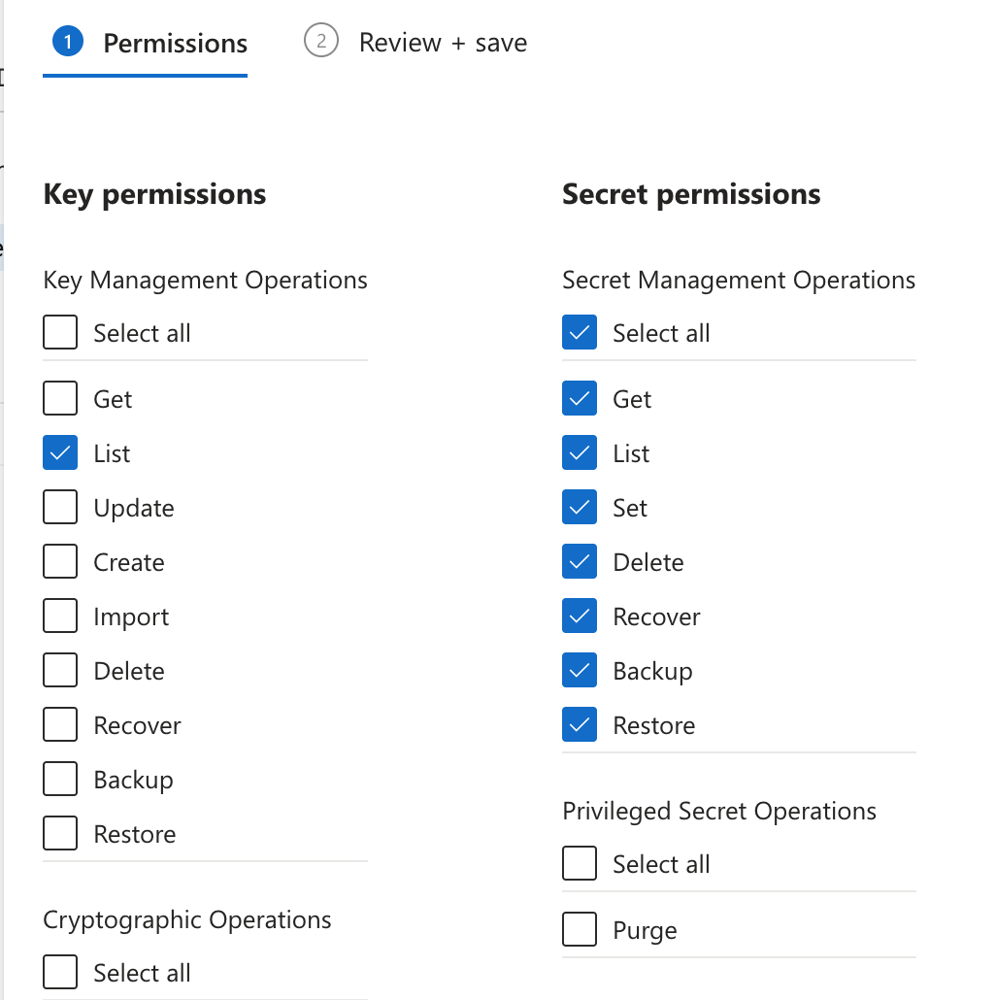

# azd Open Issues

This document summarizes some minor technical issues when running `azd` commands. 

## 1. Layered Provisioning

The deployment uses [layered provisioning](https://devblogs.microsoft.com/azure-sdk/azure-developer-cli-azd-november-2025/), which is a beta feature since November 2025:

- [Azure Developer CLI Tutorial](https://devblogs.microsoft.com/devops/azure-developer-cli-azure-container-apps-dev-to-prod-deployment-with-layered-infrastructure/)
- [Azure Developer CLI Example](https://github.com/puicchan/azd-dev-prod-aca-storage)

Layered provisioning deploys supporting infrastructure before applications.  
The `azure.yaml` services then showcase applications, developer experience and business value.

### 1.1. Deployment with azd up

If you run `azd up` instead of layered provisioning commands, you may receive incorrect prompts for parameters.  
The following related issues were logged.  

- [Resolve dependencies between provisioning layers before prompting](https://github.com/Azure/azure-dev/issues/7182)
- [Support hooks per provisioning layer](https://github.com/Azure/azure-dev/issues/7186)

This issue only occurs once, so work around it by quitting the deployment and re-running `azd up`.

### 1.2. Teardown with azd down

When you run `azd down` locally you may sometimes get the following type of [deletion error](https://learn.microsoft.com/en-us/answers/questions/2105039/using-azd-the-command-azd-down-gave-this-error-err):

```json
{
  "id": "/subscriptions/3d52ec16-06b8-4b44-bdfd-9fdd056e16f1/providers/Microsoft.Resources/locations/uksouth/deploymentStackOperationStatus/bfbf843e-cb1f-47a3-a33a-2565d9272c76",
  "name": "bfbf843e-cb1f-47a3-a33a-2565d9272c76",
  "status": "failed",
  "error": {
    "code": "DeploymentStackDeleteFailed",
    "message": "One or more stages of deploymentStack deletion failed. Correlation id: '4b9f3b206a1c02b4eea5c374d3ef1dde'.",
    "details": [
      {
        "code": "DeploymentStackDeleteResourcesFailed",
        "message": "An error occurred while deleting resources. These resources are still present in the stack but can be deleted manually. Please see the FailedResources property for specific error information. Deletion failures that are known limitations are documented here: https://aka.ms/DeploymentStacksKnownLimitations"
      }
    ]
  }
}
```

If so, you may need to clean up resources manually in the Azure Portal or the Azure CLI.  
The following commands use the Azure CLI, starting with deletion of the resource group:

```bash
az group delete --name rg-dev --yes
```

Next, get the Entra ID resource, and delete it if found:

```bash
CLIENT_ID=$(az ad app list --display-name curity-idsvr-dev --query "[0].appId" -o tsv)
az ad app delete --id "$CLIENT_ID"
```

Next, get the deleted keyvault resource, and purge it if found:

```bash
NAME=$(az keyvault list-deleted --query "[0].name" -o tsv)
az keyvault purge --name "$NAME"
```

Next, get the deleted AI foundry resource, and purge it if found:

```bash
NAME=$(az cognitiveservices account list-deleted --query "[0].name" -o tsv)
az cognitiveservices account purge --name "$NAME" --resource-group rg-dev --location uksouth
```

## 2. Key Vault

Local deployments to Azure write secrets to an Azure key vault.  
Doing so enables `azd pipeline config` to automatically transfer secrets to GitHub workflows later.

### 2.1. Setting Secrets in Hooks

The deployment uses hooks to generate strong backend secrets and I would like to use the following command:

```bash
azd env set-secret MYSECRET 'my value'
```

The command writes a value of the following form to the `.env` file, to support [transfer to GitHub](https://github.com/Azure/azure-dev/blob/main/cli/azd/docs/using-environment-secrets.md#secrets):

```bash
MYSECRET="akvs://3d52ec16-06b8-4b44-bdfd-9fdd056e16f1/kv-devvnfh4isv54wpu/MYSECRET"
```

If I try to call `azd env set-secret` silently, it cannot work out the key vault name.  
I work around this by calling the `az` command and updating the `.env` file manually.

### 2.2. Key Vault Permissions

The `azd pipeline config` command adds the managed identity for the GitHub workflow identity to the Azure Key Vault.  
The GitHub workflow account then has permissions to read secrets and copy them to GitHub.



In some cases, `azd pipeline config` may [remove your Azure CLI permissions to the Azure Key Vault](https://github.com/Azure/azure-dev/issues/1473).  
If you run into that issue, manually create a Key Vault access policy for your user account.  
Use the above permissions and also add the `Purge` permission so that `azd down` can correctly clean up the key vault.
