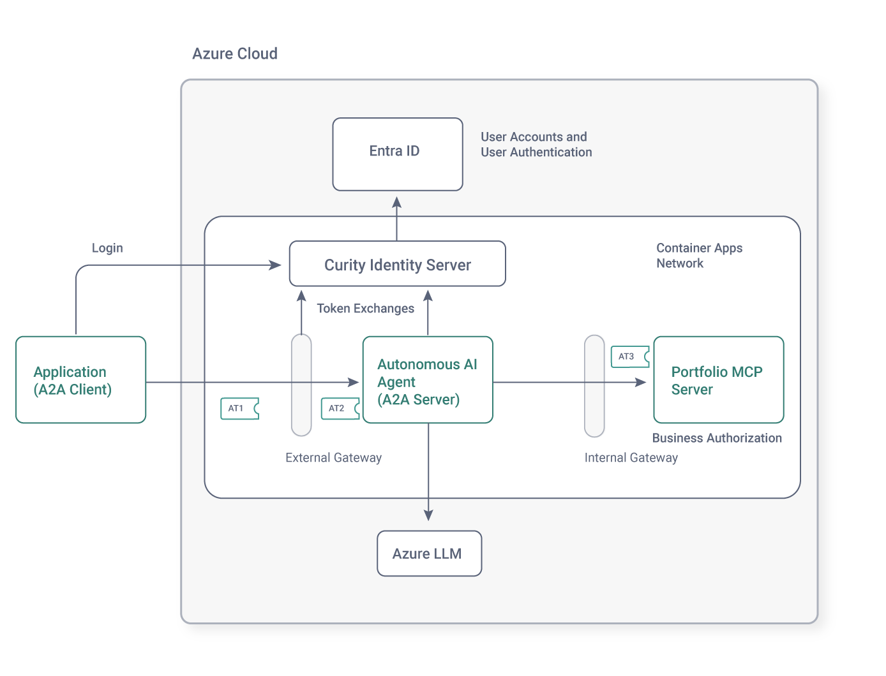

# Secured Autonomous Agent

[](https://curity.io/resources/code-examples/status/)
[](https://curity.io/resources/code-examples/status/)

An azd template to showcase an enterprise AI security architecture with OAuth 2.0 token intelligence.  
Agents can act autonomously, and resource servers enforce administrator controls and human approvals.

Enables customer users to run internet applications that integrate with Azure AI Foundry and enterprise data.  
Users can manipulate authorized data in flexible ways, with [rich responses](docs/AI-DATA-REPORTING.md) from the AI model.

```text
Give me a markdown report on the last 3 months of stock transactions and the value of my portfolio
```

## Features

The repository demonstrates the following main features:

- C# application code to integrate a backend agent with Azure AI Foundry.
- C# application code to use OpenID Connect to authenticate users and get initial access tokens.
- C# A2A server and MCP server code to use OAuth 2.0 to validate and exchange access tokens.
- Configuration and deployment of identity systems and API gateways.

## Resources

The code provides 3 applications, developed with Microsoft SDKs:

- A console client serves as a secured internet application that uses A2A to send customer support requests.
- A secured backend agent processes customer support requests and integrates with Azure AI Foundry.
- An MCP server uses optimal access tokens and claims-based authorization to protect enterprise resources.

The resources support multiple deployment scenarios:

- Xunit test driven development to verify MCP server security as a standalone component.
- A local end-to-end deployment with user authentication, to promote token understanding.
- An Azure deployment that can be triggered from the local computer or a GitHub workflow.

## Architecture

Enterprises use productive programming languages to build applications that use Microsoft AI technology.  
Resource servers authorize using access token attributes and can apply dynamic runtime access controls.



## Getting Started

Use an Azure development account with access to the Azure portal.  
Follow the [Azure AI README](docs/AZURE-AI-SETUP.md) to get connected to Azure LLMs for development in a compliant Azure region.  

### Create a Project

Create a project from the template, and set an initial environment name of `dev` when prompted.  
Check the new project into source control, so that you can configure a GitHub workflow later.

```bash
mkdir my-secure-ai-integration && cd my-secure-ai-integration
azd init --template curityio/azd-ai-autonomous-agent
azd env set AZURE_LOCATION='uksouth'
```

### Local Environment

Use a Windows, macOS or Linux computer with a Linux-based shell (such as Git bash on Windows).  
Install the latest versions of the following local computer tools:

- **Azure CLI** (`az`) - to connect to Azure AI Foundry with an Azure CLI credential
- **Azure Developer CLI** (`azd`) to use higher level commands to manage projects and deploy to Azure
- **.NET SDK 10+** (to build and run C# applications)
- **Docker** and **Docker Compose** (to build custom Docker images for identity components)
- **openssl** (to create runtime secrets)
- **envsubst** (to configure dynamically generated parameter values)
- **jq** (to read JSON in bash scripts)

### Quick Start

The quick start enables you to integrate all C# applications locally, and run an end-to-end flow.  
Log in to the Azure CLI so that the local agent can present a CLI identity to the Azure AI Foundry:

```bash
az login
```

Run a local deployment that runs the agent and MCP server, along with Docker identity infrastructure:

```bash
./tools/local/backend.sh
```

The first time you run a deployment, a CLI uses the browser to sign you in at Curity.  
The CLI then uses an access token to download a trial license for the Curity Identity Server.

Then, run a console application that connects to the local backend.  
When prompted with a login form, enter any username to simulate real user authentication:

```bash
./src/ConsoleClient/run.sh
```

See the [Development README](docs/DEVELOPMENT.md) to learn more about local development behaviors.

## Deployment

This template includes an infrastructure-as-code (IaC) deployment to Azure.   
Continue to use an Azure development account and ensure that you also have Entra ID resources:

- A tenant to which the deployment can add an app registration.
- At least one user account with which you can test Entra ID logins.


### Run the Deployment

Log in to the Azure Developer CLI, to use azd deployment commands:

```bash
azd auth login
```

The deployment uses [layered provisioning](https://devblogs.microsoft.com/azure-sdk/azure-developer-cli-azd-november-2025/), so deploy to Azure in layers, starting with the base infrastructure:

```bash
azd provision base
```

Next, deploy identity infrastructure:

```bash
azd provision identity
```

Finally, deploy C# applications:

```bash
azd deploy
```

### Test the Deployment

Once the deployment completes, re-run the console application, pointing it the Azure backend.  
Sign in with an Entra ID user account and the configured Entra ID user authentication method:

```bash
export A2A_EXTERNAL_URL=$(azd env get-value A2A_EXTERNAL_URL)
./src/ConsoleClient/run.sh
```

### Create a GitHub Workflow Deployment

Once you have a working Azure deployment, create a GitHub workflow to deploy C# code changes.  

```bash
azd pipeline config
```

Select the following options to configure your GitHub pipeline and commit changes:

- Federated User Managed Identity (MSI + OIDC)
- Create new User Managed Identity (MSI)
- Select your preferred region
- Use the existing `rg-dev` resource group

You can run `azd pipeline config` multiple times, in which case you may receive additional prompts.  
Choose options like the following, to keep GitHub values in sync with the local Azure deployment:

- Set ALL existing variables again.
- Set ALL existing secrets again.
- Delete ALL unused variables from the pipeline.
- Delete ALL unused secrets from the pipeline.

The `azd pipeline config` command copies variable and secret values referenced in the `.env` file to GitHub.  
Browse to the following locations in your GitHub repository to view the details:

```text
https://github.com/<organization>/<repository>/settings/variables/actions
https://github.com/<account>/<repository>/actions/workflows/azure-<stage>.yml
```

An Entra ID managed identity named `msi-ai-autonomous-agent` runs the deployment.  
The GitHub workflow runs when you trigger it manually, or if you commit C# code changes to the `main` branch.  

### Tear Down the Deployment

To free resources after a local deployment, run the following command:

```bash
azd down --force --purge --no-prompt
```

To free resources after a GitHub workflow deployment, edit the [GitHub workflow](.github/workflows/azure.yml).  
Set the following jobs to `if: false`, set the `teardown` job to `if: true`.  
Then re-run `azd pipeline config` and commit changes to trigger the teardown.

- deploy-base-infra
- deploy-identity-infra
- applications

### Further Information

- The [Azure Deployment](docs/AZURE-DEPLOYMENT.md) document explains more about the deployed resources.
- The [Azure Endpoints](docs/AZURE-ENDPOINTS.md) document explains more about how to locate and test connections.
- The [azd Open Issues](OPEN-ISSUES.md) document explains more about troubleshooting azd technical issues.

## Important Security Notice

This template, the application code, and configuration, showcase an architecture to protect business data.  
However, further security work should be done to harden security for production systems.  
The [Security Document](SECURITY.md) summarizes the use of both managed identities and password credentials.

## Guidance

Use the following guidance to choose an Azure region and to plan costs.

### Region Availability

This template uses **gpt-4.1-mini** which may not be available in all Azure regions.  
Check for [up-to-date region availability](https://learn.microsoft.com/azure/ai-services/openai/concepts/models#standard-deployment-model-availability) and select a region during deployment accordingly.  
Consider using **East US 2**, **Sweden Central** or **UK South**.

### Costs

The template uses a container apps private network to run a backend AI agent that uses token-based pricing.  
You can estimate the cost of this project's architecture with [Azure's pricing calculator](https://azure.microsoft.com/pricing/calculator/).

* [Azure AI Services](https://azure.microsoft.com/pricing/details/cognitive-services/openai-service/)
* [Container Apps](https://azure.microsoft.com/en-us/pricing/details/container-apps/)
* [Virtual Networks](https://azure.microsoft.com/pricing/details/virtual-network/)

## Token Intelligence

The deeper behaviors are a future-proof backend AI deployment with security controls.

### API Gateways

- An external gateway delivers downscoped JWT access tokens to agents.
- An internal gateway runs between agents and resource servers, as a pattern to govern agent access.

### Curity Identity Server

- Delivers least-privilege access tokens to agents and other clients, to restrict levels of access.
- Enables resource servers and gateways to use any dynamic token claims, for flexible access control.
- Exchanges tokens so that agents can federate to complete complex tasks.

### Entra ID

A specialist token issuer can integrate with existing identity systems.  
In the example deployment, Entra ID is used for all user account storage and user authentication.

### Learn More

- See the [Token Flow README](docs/TOKEN-FLOW.md) to understand the token details for the customer support use case.
- See the [OAuth Configuration README](docs/OAUTH-CONFIGURATION.md) to understand OAuth security settings.
- See the [Advanced Use Cases README](docs/ADVANCED-USE-CASES.md) for flows to meet other enterprise requirements.

## License

This project is licensed under the [Apache License 2.0](LICENSE.md).
 
