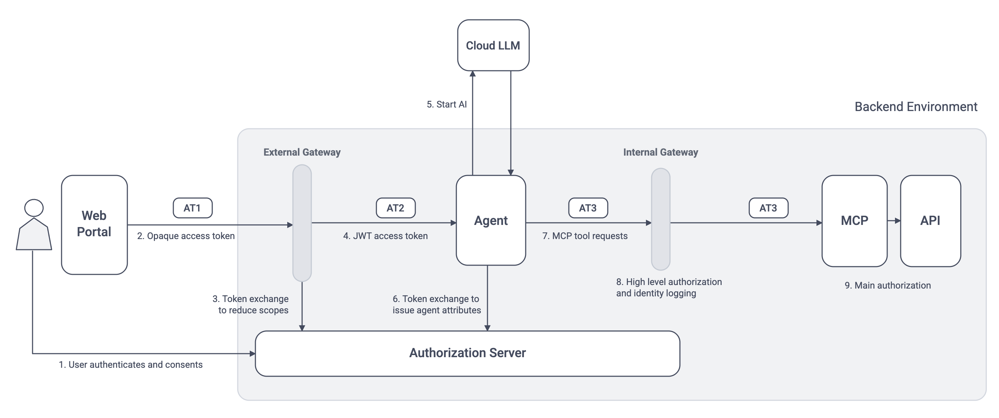
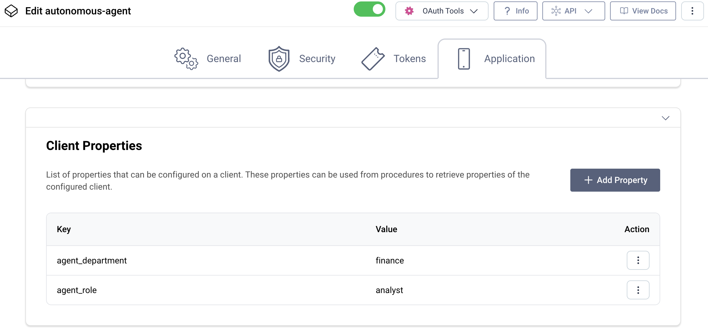

# Initial Token Flow

Each backend component receives optimal tokens with security context, to enable correct business authorization.



## Initial Access Token (AT1)

The external A2A client receives an opaque access token of the following form.  
This access token format prevents internet clients from reading potentially sensitive access token payloads.

```text
_0XBPWQQ_2fb1bc61-0e98-413c-a44d-d8a46d3bd2f2
```

The underlying token claims would be those of a customer support application, such as `openid stocks/read`.  
In many use cases, the customer support application could have multiple scopes that the agent should not have access to.

## Agent Access Token (AT2)

The external gateway uses [Token Exchange](https://curity.io/resources/learn/token-exchange-flow/) to reduce the scopes of the access token to `stocks/read`.  
The token exchange also converts the format of the incoming access token to a JWT.  

```json
{
  "jti": "a1a5fda5-e5a7-4c5a-81be-e95fcbbd1907",
  "delegationId": "dda57127-6cc2-4e7f-b8ec-ad3d4626a2f2",
  "exp": 1788769571,
  "nbf": 1788768671,
  "scope": "openid stocks/read",
  "iss": "http://localhost:8443/oauth/v2/oauth-anonymous",
  "sub": "934d737304b1bbc5cc0d443749e64a473211cb5af9e88b069abbd0ed728741b9",
  "aud": [
    "https://agent.demo.example"
  ],
  "iat": 1788768671,
  "purpose": "access_token",
  "customer_id": "2109",
  "region": "USA",
  "client_id": "console-client"
}
```

The agent validates the JWT before triggering any operations that invoke the Azure LLM.  
The agent only accepts tokens with an audience restriction of `https://agent.demo.example` and requires a scope of `stocks/read`.

## Portfolio MCP Server Access Token (AT3)

The autonomous agent then uses token exchange to authenticate at the authorization server and get a new access token.  
The authorization server issues agent attributes to the access token, that it stores against the OAuth client.



The Portfolio MCP Server receives the following access token payload, with an updated audience claim.  
The Portfolio MCP Server only accepts tokens with an audience restriction of `https://mcp.demo.example` and a scope of `stocks/read`.

```json
{
  "jti": "6aa2b3a1-20ff-4702-b4fe-6582a53e8df2",
  "delegationId": "dda57127-6cc2-4e7f-b8ec-ad3d4626a2f2",
  "exp": 1788769571,
  "nbf": 1788768671,
  "scope": "stocks/read",
  "iss": "http://localhost:8443/oauth/v2/oauth-anonymous",
  "sub": "934d737304b1bbc5cc0d443749e64a473211cb5af9e88b069abbd0ed728741b9",
  "aud": "https://mcp.demo.example",
  "iat": 1788768671,
  "purpose": "access_token",
  "act": {
    "sub": "autonomous-agent",
    "agent_role": "analyst",
    "agent_department": "finance"
  },
  "customer_id": "2109",
  "region": "USA",
  "client_id": "console-client"
}
```

In this initial business flow, the Portfolio MCP Server implements the detailed business authorization.  
To do so it uses the following custom scopes and claims, and filters data by region and customer.  

- The MCP server requires access tokens to have a `stocks/read` scope.
- The MCP server requires access tokens to have an `agent_department=finance` claim.
- The `region` claim restricts authorized stocks to those for the current user's region.
- The `customer_id` claim restricts authorized transactions to those for the current user.

The Portfolio MCP Server returns authorized user-specific data to the agent and hence to the Azure LLM.  
The Azure LLM is able to operate on raw data in highly flexible ways, to provide business value.

## AI Token Auditing

The autonomous agent routes all backend AI agent requests for secured resources through an internal gateway.  
The gateway can write audit logs that include attributes from access tokens.  

The example deployment writes JSON audit logs that include business-centric claims, including agent attributes.  
You can ship such logs to a log aggregation system to provide visibility of large scale AI access to secured resources.  

```json
{
  "log_type":"audit",
  "time":"2026-09-04T15:53:51Z",
  "target_host":"gateway-internal",
  "target_path":"/portfolio-mcp-server",
  "target_method":"POST",
  "audience":"https://mcp.demo.example",
  "scope":"stocks/read",
  "client_id": "console-client",
  "delegation_id":"b1148748-749b-4aef-bdde-2892258fabc6",
  "customer_id":"2109",
  "region":"USA",
  "agent_id":"autonomous-agent",
  "agent_role":"analyst",
  "agent_department":"finance"
}
```

An internal gateway can perform coarse-grained authorization for all AI agent requests for secured resources.  
The gateway might enforce rules like forbidding AI agent requests with high-privilege access tokens.  
