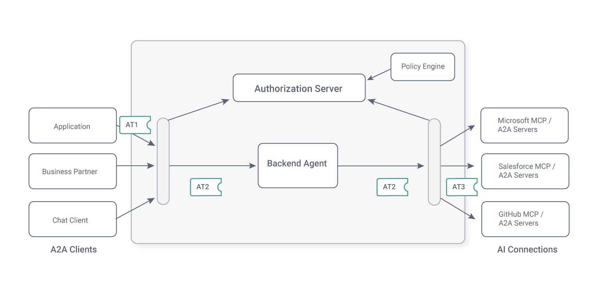
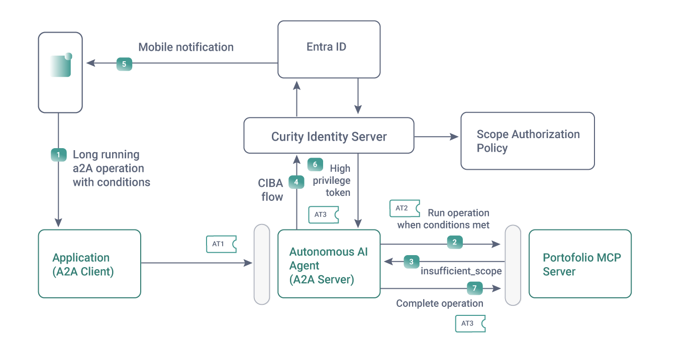

# Advanced Use Cases

The Azure deployment is a baseline that could enable various additional enterprise security use cases.  
A couple of particular AI examples are summarized below.

## 1. AI Federated Token Flows

The internal gateway can act as a [Token Broker](https://curity.io/resources/learn/agentic-access-control-with-token-vaulting/) that exchanges tokens on behalf of the AI agent.  
For example, a token broker can managed token exchanges with access tokens from external organizations.  



## 2. AI Step-Up Flows with Human Approvals

When a user is present, you can combine tokens with OAuth human approval mechanisms for [Step-up Authentication and Consent](https://curity.io/resources/learn/chatgpt-widget-haapi/).  
A2A provides a task-based API that can perform long-running operations that waits for conditions to be met, for example:

```text
Wait up to 1 week for the MSFT stock price to be 400 USD or lower.  
Then buy 50 stocks and add them to my portfolio.  
```

The Curity Identity Server can use custom backchannel authenticators to run a [CIBA Flow](https://curity.io/resources/learn/ciba-flow/) that integrates with Entra ID.  
This enables completion of high privilege transactions even when a user is not present, as illustrated in the following diagram:


