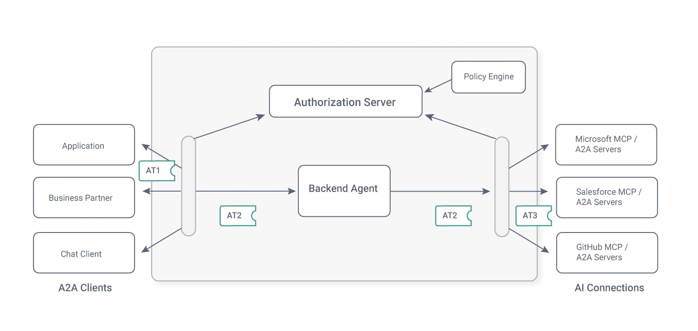
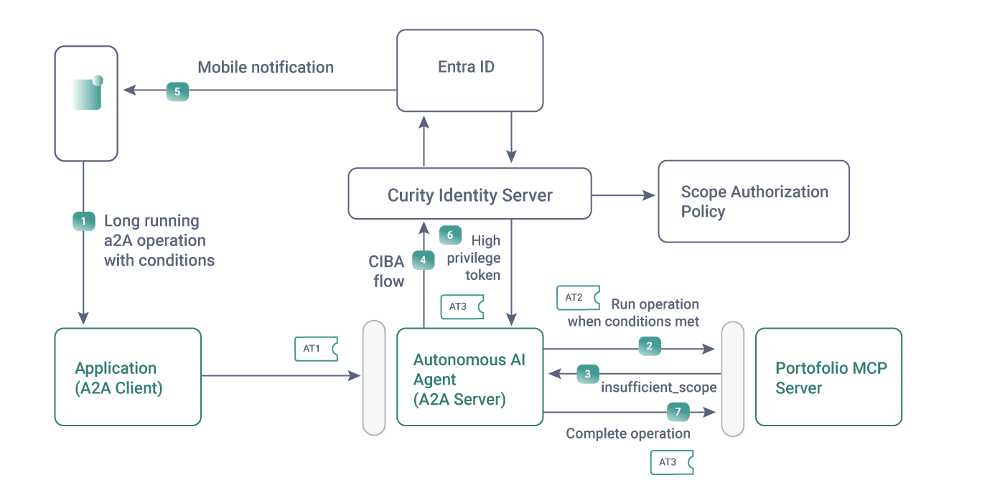

# Advanced Use Cases

The example Azure deployment could run additional flows to satisfy other enterprise use cases.

## Federated AI Token Flows

The internal gateway can act as a token broker and perform its own token exchanges for AI agent requests.  
For example, a token broker can use [SSO for AI Agents](https://curity.io/resources/learn/sso-for-ai-agents-with-openid-connect/) to get tokens for external organizations.  



## AI Human Approvals

When a user is present, you can combine tokens with OAuth human approval mechanisms for [Step-up Authentication and Consent](https://curity.io/resources/learn/chatgpt-widget-haapi/).  
A2A provides a task-based API that can perform long-running operations that waits for conditions to be met, for example:

```text
Wait up to 1 week for the MSFT stock price to be 400 USD or lower, then buy 50 stocks and add them to my portfolio
```

The Curity Identity Server can use custom backchannel authenticators to run a [CIBA Flow](https://curity.io/resources/learn/ciba-flow/) that integrates with Entra ID.  
This enables completion of high privilege transactions even when a user is not present, as illustrated in the following diagram:


