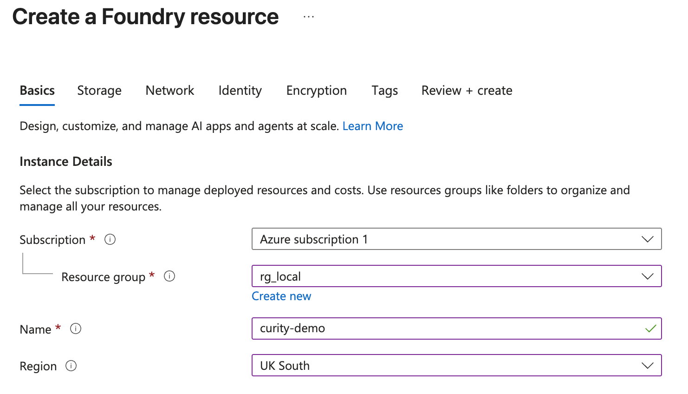
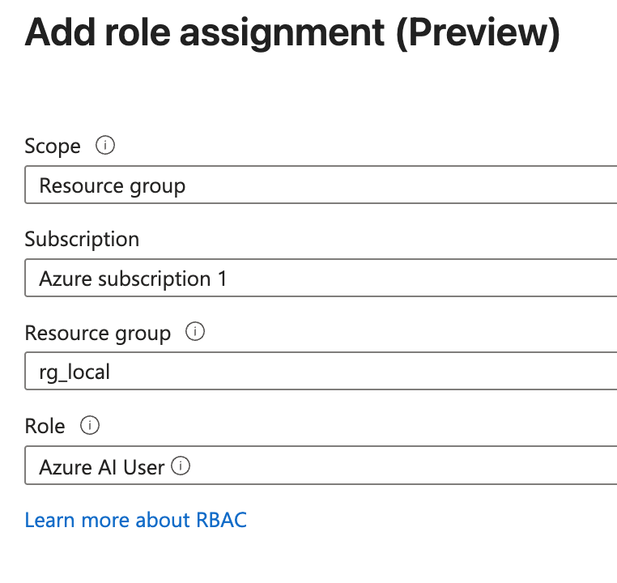

# Azure AI Foundry Setup

Use these instructions to set up an Azure AI Foundry project for development, similar to [this video](https://www.youtube.com/watch?v=UB3q4OY3pPM).

## Create a Resource Group for Local Development

To develop with Azure AI Foundry you need a local resource group for development.  
Verify that the Azure region and AI model that you configure are compatible according to the [latest Microsoft documentation](https://learn.microsoft.com/en-us/azure/foundry-classic/agents/concepts/model-region-support?tabs=global-standard).  

## Create a Foundry Project

Create a Foundry resource and give it a globally unique name.  
The following example uses a unique name of `curity-demo` in a resource group `rg_local` for the `uksouth` region:



Select `Go to resource` and select the resources's default project, named `proj-default`.  
Then select `Go to Foundry Portal` and navigate to the `Model Catalog`.  
Select a low cost model, like `gpt-4.1-mini`, select `Use this model` and deploy it.

## Grant AI Permissions

In the Foundry Portal, edit the resource, navigate to `Identity` and selecet `Azure role assignements`.  
Ensure that Azure CLI users are assigned the `Azure AI User` role.



## Configure the Autonomous Agent

Edit the `.env` file in the `src/AutonomousAgent` folder.  
Update the environment variables to match your Foundry project URL and model name.  

```bash
export AZURE_AI_FOUNDRY_PROJECT_URL='https://curity-demo.cognitiveservices.azure.com/api/projects/proj-default'
export AZURE_AI_MODEL_NAME='gpt-4.1-mini'
```
