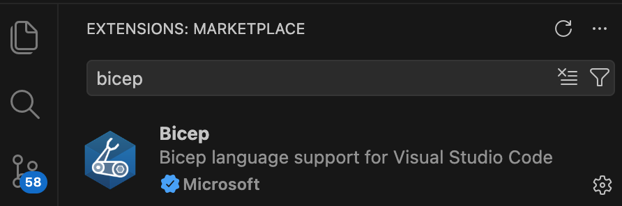

# Azure Deployment

The Azure deployment is an Azure Developer CLI (azd) template that deploys an Azure container apps backend.  

## Infrastructure as Code

The deployment uses bicep, so install the Visual Studio code extensions:



## Deployment Mechanics

By default, call `azd up`, which is equivalent to running the following commands in sequence.  
In larger setups, you could split each of these deployments into its own GitHub repository.

```bash
azd provision base
azd provision identity
azd deploy autonomous-agent
azd deploy portfolio-mcp-server
```

The following hook runs before each provisioning stage:

```bash
./infra/hooks/preprovision.sh
```

## Deploy AZD Base Infrastructure

The `azd provision base` command deploys the infrastructure from the `infra/base` folder.  
The deployment uses that folder's `main.bicep` objects, which references its `main.parameters` file.

```bash
azd provision base
```

When the `base` stage completes, the `./azure/dev/.env` file gets populated with output values.  
These values can be used in subsequent deployed stages.

```text
EXTERNAL_DOMAIN_NAME="<generated-name>.<region>.azurecontainerapps.io"
```

## Deploy AZD Identity Infrastructure

The `azd provision identity` command deploys the infrastructure from the `infra/identity` folder.  
The deployment uses that folder's `main.bicep` objects, which references its `main.parameters` file.

```bash
azd provision identity
```

When the `identity` stage completes, the `./azure/dev/.env` file gets populated with output values.  
To force a redeployment to build a new Docker image, delete the corresponding variable from the `.env` file.

```text
GATEWAY_EXTERNAL_IMAGE_NAME="<unique-prefix>.azurecr.io/gateway-external:<timestamp>"
GATEWAY_INTERNAL_IMAGE_NAME="<unique-prefix>.azurecr.io/gateway-internal:<timestamp>"
IDSVR_IMAGE_NAME="<unique-prefix>.azurecr.io/idsvr:<timestamp>"
```

## Deploy Services

You deploy each services from the `azure.yaml` file as a container app.  
These deployments run service-specific bicep files with service-specific parameter files.  
The parameter files reference parameters that earlier provisioning added to the `./azure/dev/.env` file.

## Use the Deployed System

After a successful deployment you can run the following commands to run the agent against an Azure backend:

```bash
export A2A_EXTERNAL_URL=$(azd env get-value A2A_EXTERNAL_URL)
./src/ConsoleClient/run.sh
```

Typically though, you need to understand endpoints, configuration and know how to troubleshoot:

- The [Azure Endpoints](AZURE-ENDPOINTS.md) document explains how to identify workloads, view logs and test connections.
- The [OAuth Configuration](OAUTH-CONFIGURATION.md) document explains the most important OAuth settings.

## Base Infrastructure

- **Resource Group**: `rg-<env>`

- **Virtual Network** with a subnet delegated to Container Apps

- **Container Apps Environment** (Consumption) with Azure Monitor logs enabled

- **Container Registry** + **Deployment Identity** with permissions to pull custom Docker containers

- **Azure AI Foundry Resource**, including a foundry project and a low cost `gpt-4.1-mini` model

## Identity Infrastructure

- **Storage Account** + **Azure Files Share** `config-files`

  - `kong-external.xml` - routes for the external API gateway that use external HTTPS URLs
  - `kong-internal.xml` - routes for the internal API gateway that use internal HTTP URLs
  - `cluster.xml` for the Curity Identity Server
  
- **Container App: Kong External Gateway**

  - image: from `kong/kong:3.9-ubuntu`
  - ingress: HTTPS to port **443**
  - internal ports exposed: **8000**
  - mounts:
    - `/usr/local/kong/declarative/kong-external.yml` (Azure Files, `subPath: kong-external.yml`)

- **Container App: Kong Internal Gateway**

  - image: from `kong/kong:3.9-ubuntu`
  - internal ports exposed: **8000**
  - mounts:
    - `/usr/local/kong/declarative/kong-internal.yml` (Azure Files, `subPath: kong-internal.yml`)

- **Azure SQL Server** (public network enabled) + **Azure SQL Database** `curity-db`
  
  -  SQL firewall rules are open for development: `AllowAllAzureIps` and `AllowAll (0.0.0.0 - 255.255.255.255)` are created in
     `infra/core/database/sqlserver.bicep`. Tighten these for any real environment.

- **Container App: Curity Identity Server Database Initialization**

  - image: from `mcr.microsoft.com/mssql-tools`

- **Container App: Curity Identity Server Admin Workload**

  - image: from `curity.azurecr.io/curity/idsvr:latest`
  - ingress: HTTPS to port **6749**
  - internal ports exposed: **6789**, **6790**, **4465**, **4466**
  - mounts:
    - `/opt/idsvr/etc/init/cluster.xml` (Azure Files, `subPath: cluster.xml`)

- **Container App: Curity Identity Server Runtime Workload**

  - image: from `curity.azurecr.io/curity/idsvr:latest`
  - ingress: HTTPS to port **8443**
  - internal ports exposed: **6790**, **4465**, **4466**
  - scales **1..5** replicas

- **Entra ID Client Registration** which sets the following properties in the Curity configuration:

  - `ENTRA_CLIENT_ID`
  - `ENTRA_CLIENT_SECRET`
  - `ENTRA_OIDC_METADATA_URL`

## Applications

- **Container App: Autonomous Agent**

  - image: from `mcr.microsoft.com/dotnet/aspnet:10.0`
  - internal ports exposed: **3000**

- **Container App: Portfolio MCP Server**

  - image: from `mcr.microsoft.com/dotnet/aspnet:10.0`
  - internal ports exposed: **3001**

## Deployment Scripting

The `azure.yaml` file configures the following hooks:

- **preprovision** (`infra/hooks/preprovision.sh`)

  - Creates custom Docker images for gateways and the Curity Identity Server
  - Creates final configuration from runtime domain names and secrets
  - Generates a `cluster.xml` for the Curity Identity Server
  - Creates an Entra ID app registration named `curity-idsvr-<env>`

- **predown** (`infra/hooks/predown.sh`)

  - Runs during teardown, to delete the Entra app registration created for this environment
