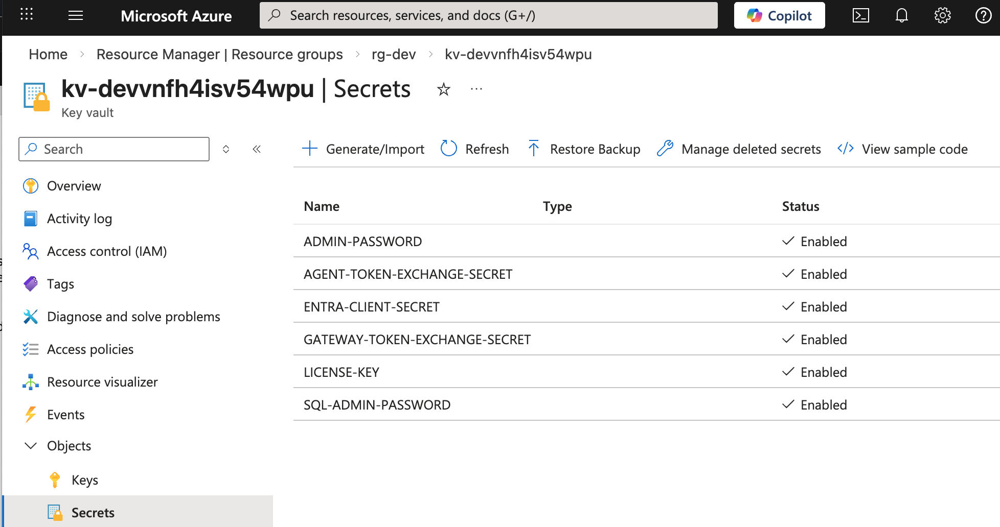

# Azure Endpoints

After deployment, the following instructions explain ways to connect to deployed workloads.

## List All Container Apps

List the names of all container apps:

```bash
az containerapp list -g rg-dev --query "[].name"
```

For container apps that provide HTTP endpoints, the results provide load-balanced internal hostnames.  
You can call those container apps using a hostname without a port.

```json
[
  "autonomous-agent-dev",
  "portfolio-mcp-server-dev",
  "dbinit-dev",
  "idsvr-admin-dev",
  "idsvr-runtime-dev",
  "gateway-external-dev",
  "gateway-internal-dev",
  "utility-dev"
]
```

## Verify Workload Startup

View details of deployed workloads and ensure that the replica state is `Running`:

```bash
WORKLOAD_NAME='portfolio-mcp-server-dev'
az containerapp show --resource-group rg-dev --name "$WORKLOAD_NAME"
az containerapp replica list --resource-group rg-dev --name "$WORKLOAD_NAME" --query "[].properties.containers[].runningState" -o tsv
```

If there are startup errors, view logs for replicas of the container app:

```bash
WORKLOAD_NAME='portfolio-mcp-server-dev'
CONTAINER_ID=$(az containerapp replica list \
  --resource-group rg-dev \
  --name "$WORKLOAD_NAME" \
  --query '[].name' \
  --output tsv | head -n 1)

az containerapp logs show \
  --resource-group rg-dev \
  --name "$WORKLOAD_NAME" \
  --replica "$CONTAINER_ID" \
  --follow
```

## Call Internal URLs

Get a shell to the utility container to call endpoints using the `curl` and `jq` tools:

```bash
az containerapp exec --name utility-dev --resource-group rg-dev --command bash
```

Call unsecured endpoints of the Curity Identity Server:

```bash
curl -s http://idsvr-runtime-dev/oauth/v2/oauth-anonymous/.well-known/openid-configuration | jq
curl -s http://idsvr-runtime-dev/oauth/v2/oauth-anonymous/jwks | jq
```

Call the Autonomous Agent's card endpoint and secured endpoints:

```bash
curl -s http://autonomous-agent-dev/.well-known/agent-card.json | jq
curl -i http://autonomous-agent-dev
```

Call the Portfolio MCP Server's resource metadata endpoint and secured endpoints:

```bash
curl -s http://portfolio-mcp-server-dev/.well-known/oauth-protected-resource | jq
curl -i http://portfolio-mcp-server-dev
```

Call the Portfolio MCP Server via the internal gateway:

```bash
curl -s http://gateway-internal-dev/mcp/.well-known/oauth-protected-resource | jq
curl -i http://gateway-internal-dev/mcp
```

## Call External URLs

After deployment, run commands such as the following, to reference outputs from the end of the `main.bicep` file.

```bash
source <(azd env get-values)
```

Internet applications will connect to external endpoints:

```bash
curl -s "$A2A_EXTERNAL_URL/a2a/.well-known/agent-card.json" | jq
curl -s "$IDSVR_RUNTIME_URL/oauth/v2/oauth-anonymous/.well-known/openid-configuration" | jq
curl -s "$IDSVR_RUNTIME_URL/oauth/v2/oauth-anonymous/jwks" | jq
```

In a real deployment you could assign additional external hostnames to container apps, such as:

```text
A2A_EXTERNAL_URL=ai.example.com
IDSVR_RUNTIME_URL=login.example.com
```

## View Secret Values

The deployment generates some strong secrets which are stored in the Azure Key Vault.  
Use the Azure Portal to look up secret values, like the `ADMIN_PASSWORD` for the Admin UI:



## View OAuth Settings

Follow the [OAuth Configuration README](OAUTH-CONFIGURATION.md) to understand OAuth settings:

- Use the Azure Portal to view Entra ID configuration.
- Use the Admin UI to view Curity Identity Server configuration.

## Connect to Identity Data

Get a shell to the dbinit container:

```bash
az containerapp exec --name dbinit-dev --resource-group rg-dev --command bash
```

Get the SQL admin password and connect with the following command:

```bash
/opt/mssql-tools/bin/sqlcmd -S "sql-$UNIQUE_PREFIX.database.windows.net" -d "curity-db" -U "sqladmin" -P "$SQL_ADMIN_PASSWORD" -C
```

Then run SQL commands to view token-related data that gets stored in Azure SQL:

```sql
SELECT * from delegations
GO
SELECT * from tokens
GO
```
