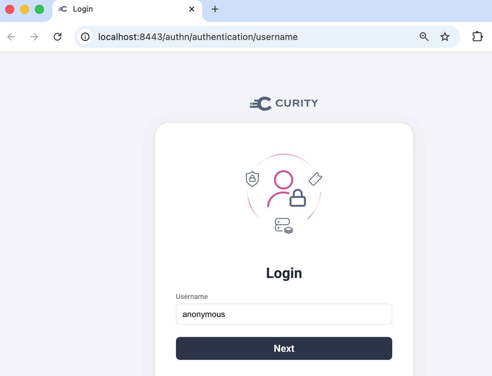

# Development

On a local computer you can run local end-to-end flows or develop a single component at a time.  

## Application Components

An organization would use .NET to develop high-level application components:

- The [Autonomous Agent](../src/AutonomousAgent/README.md) is an A2A server that integrates with an Azure LLM.
- The [Portfolio MCP Server](../src/PortfolioMcpServer/README.md) is a resource server that the LLM instructs the agent to call.
- The [Internet Application](../src/ConsoleClient/README.md) is any app that runs an A2A client and sends access tokens.

## Docker Components

After deployment, Docker provides the following backend components:

- Autonomous Agent (A2A Server): `http://localhost:3000`
- Portfolio MCP Server: `http://localhost:3001`
- Curity Identity Server OAuth Endpoints: `http://localhost:8443`
- Curity Identity Server Admin Endpoints: `http://localhost:6749/admin`
- An external API gateway at `http://localhost` that exchanges incoming opaque access tokens for downscoped JWTs
- An internal API gateway at `http://localhost:81` that audits secure requests from the autonomous agent

Run the console client to sign in and get an access token with which to call the Anonymous Agent:

```bash
./src/ConsoleClient/run.sh
```

The local computer deployment uses the simplest form of authenticator, where you only enter a username.  
You can enter any value to quickly get an access token for the local computer environment.



The minimal client then calls the autonomous agent with a naural language command and the access token.  
Wait a few seconds and you will get a report that the Azure LLM produces.

## Use Test-Driven Development

MCP or A2A server developers do not have to run local end-to-end flows as part of normal development.  
Instead, they can work on a single component at a time, using test-driven development.

To demonstrate test-driven development, first stop the local backend if it is running.  
Then, use the following commands to run the API with a test configuration and run some integration tests:

```bash
cd src/PortfolioMcpServer
./test.sh
```

The [OAuth integration tests](../src/PortfolioMcpServer/security-tests/src/SecurityTests.cs) send mock JWT access tokens tp the Portfolio MCP Server.  
Developers could extend tests to enable productive testing of many access token security conditions:

```text
[xUnit.net 00:00:00.26] SecurityTests: >>> Starting mock authorization server ...
[xUnit.net 00:00:00.47] SecurityTests: >>> Stopping mock authorization server ...
  Passed SecureMcpRequest_GetAvailableStocks_SucceedsWithValidAccessToken [178 ms]
  Passed SecureMcpRequest_ListTools_Returns401ForAccessTokenWithInvalidAudience [9 ms]
```

## Microsoft .NET AI Libraries

C# and the following Microsoft AI libraries are used to build the application components.  
As a result, both AI protocol complexity and security protocol complexity are externalized from application code.

- The autonomous AI agent uses the [Microsoft Agent Framework](https://github.com/microsoft/agent-framework), where foundry agents are the most up to date option.  

- To run as an A2A server or make outbound A2A requests, the agent uses the [A2A .NET SDK](https://github.com/a2aproject/a2a-dotnet).

- To make outbound MCP client connections, and to secure inbound A2A, the agent uses the [MCP .NET SDK](https://github.com/modelcontextprotocol/csharp-sdk).  
