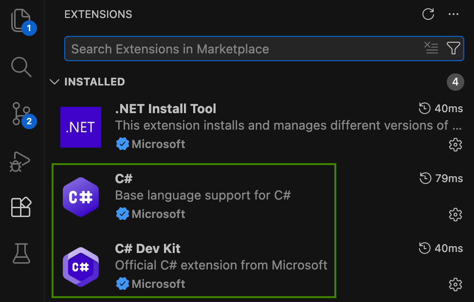

# Development

On a local computer you can run local end-to-end flows or develop a single component at a time.  

## Application Components

An organization would use .NET to develop high-level application components:

- The [Autonomous Agent](../src/AutonomousAgent/README.md) is an A2A server that integrates with an Azure LLM.
- The [Portfolio MCP Server](../src/PortfolioMcpServer/README.md) is a resource server that the LLM instructs the agent to call.
- The [Internet Application](../src/ConsoleClient/README.md) is any app that runs an A2A client and sends access tokens.

## Development Prerequisites

On Windows, use a Linux bash shell like Git bash.  
Follow the [Azure AI Setup](AZURE-AI-SETUP.md) to get connected to an Azure LLM.  
In Visual Studio Code, add the following C# extensions.  



## Run a Local End-to-End Flow

Log in to the Azure CLI so that the local agent can authenticate to Azure with a token credential:

```bash
az login
```

Run local backend components for the Curity Identity Server, API gateways, the autonomous agent and the MCP server:

```bash
./tools/local/backend.sh
```

After deployment, backend components run at the following URLs:

- Autonomous Agent (A2A Server): `http://localhost:3000`
- Portfolio MCP Server: `http://localhost:3001`
- Curity Identity Server OAuth Endpoints: `http://localhost:8443`
- Curity Identity Server Admin Endpoints: `http://localhost:6749/admin`
- An external API gateway at `http://localhost` that exchanges incoming opaque access tokens for downscoped JWTs
- An internal API gateway at `http://localhost:81` that audits secure requests from the autonomous agent

Run the console client to sign in and get an access token with which to call the Anonymous Agent:

```bash
./src/ConsoleClient/run.sh
```

The local computer deployment uses the simplest form of authenticator, where you only enter a username.  
You can enter any value to quickly get an access token for the local computer environment.


The minimal client then calls the autonomous agent with a natural language command and the access token.  
Wait a few seconds and you will get a report that the Azure LLM produces.

## Use Test-Driven Development

MCP or A2A server developers do not have to run local end-to-end flows as part of normal development.  
Instead, use test driven development to work on a single component at a time.

When required, server developers can use test-driven development with mock access tokens.  
The [Portfolio MCP Server Tests](../src/PortfolioMcpServer/security-tests/src/SecurityTests.cs) demonstrates a local integration test for sending access tokens to servers.

```bash
cd src/PortfolioMcpServer
./test.sh
```

## Microsoft .NET AI Libraries

C# and the following Microsoft AI libraries are used to build the application components.  
As a result, both AI protocol complexity and security protocol complexity are externalized from application code.

- The autonomous AI agent uses the [Microsoft Agent Framework](https://github.com/microsoft/agent-framework), where foundry agents are the most up to date option.  

- To run as an A2A server or make outbound A2A requests, the agent uses the [A2A .NET SDK](https://github.com/a2aproject/a2a-dotnet).

- To make outbound MCP client connections, and to secure inbound A2A, the agent uses the [MCP .NET SDK](https://github.com/modelcontextprotocol/csharp-sdk).  
