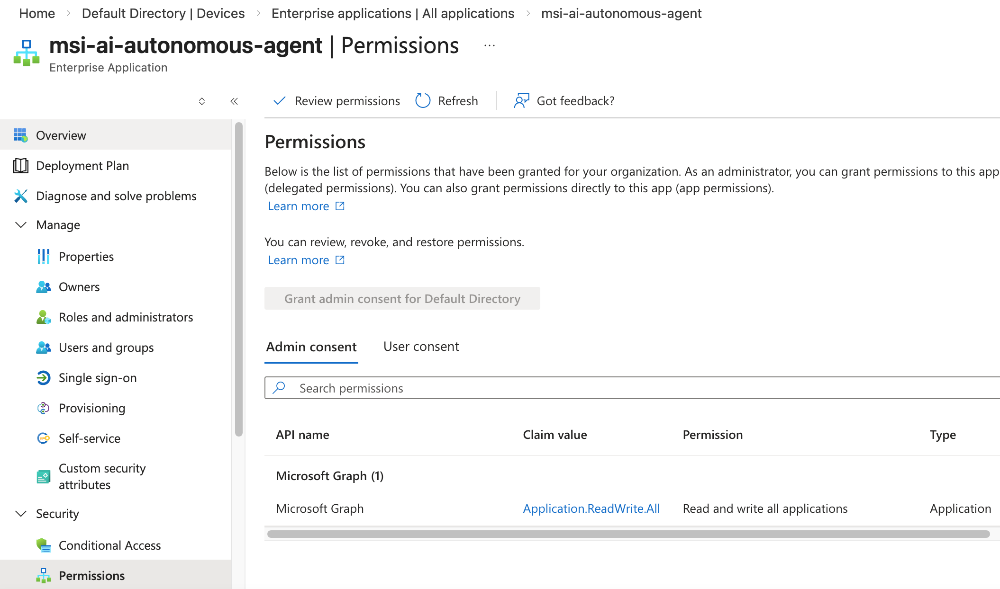

# GitHub Workflow

This document explains how to create a GitHub workflow and troubleshoot integration issues.

## Create the Initial Pipeline Stage

If you have an existing `dev` deployment, delete or rename the local `.azure` folder.  
Then use the following command to configure a GitHub workflow for your cloned repository.  

```bash
azd pipeline config --auth-type federated
```

The deployment uses [layered provisioning](https://learn.microsoft.com/en-us/azure/developer/azure-developer-cli/layered-provisioning), which `azd pipeline config` may not yet fully support.  
Running `azd pipeline config` may prompt for many parameters that are set later in the deployment.  
If so, comment out the identity layer in the `azure.yaml` file to work around that issue, and re-run the command.

```yaml
infra:
  layers:
    - name: base
      path: ./infra/base
    #- name: identity
    #  path: ./infra/identity
```

Set up the `dev` stage of the deployment pipeline, with outputs of the following form.  

- Enter a unique environment name: `dev`
- Select Azure subscription: `<your subscription>`
- Select a value for the location infrastructure parameter: `<your preferred region>`
- Select how to authenticate the pipeline to Azure: `Federated User Managed Identity (MSI + OIDC)`
- Do you want to create a new User Managed Identity (MSI) or use an existing one? `Create new User Managed Identity (MSI)`
- Select the location to create the managed service identity. `<your preferred region>`
- Pick a resource group to use: `Create a new resource group`
- Enter a name for the new resource group: `rg-dev`

Follow all prompts, undo the `azure.yaml` workaround, then commit all changes when prompted to do so.

## View GitHub Workflow Variables

In your GitHub repository, navigate to the following URL, to manage variables and secrets:

```text
https://github.com/<organization>/<repository>/settings/variables/actions
```

You should see the following initial variables:

- AZURE_CLIENT_ID
- AZURE_ENV_NAME
- AZURE_LOCATION
- AZURE_RESOURCE_GROUP
- AZURE_SUBSCRIPTION_ID
- AZURE_TENANT_ID

## Create GitHub Workflow Secrets

In GitHub, create secrets for the following variables, by generating 4 strong passwords.  
Make a backup of the values so that you can use them later for testing.  

- ADMIN_PASSWORD
- SQL_ADMIN_PASSWORD
- GATEWAY_TOKEN_EXCHANGE_SECRET
- AGENT_TOKEN_EXCHANGE_SECRET
- LICENSE_KEY

Use the following command to get the value for the `LICENSE_KEY` secret:

```bash
cat ./tools/idsvr/license.json | jq -r .License
```

## Configure Entra ID Permissions

When you run `azd pipeline config`, a managed identity is created for the GitHub workflow.  
In the Azure Portal, browse to Entra ID and navigate to `Enterprise Applications`.  
Select `Application Type = Managed Identities` and view permissions:



The client must be granted the `Application.ReadWrite.All` permission to Microsoft Graph APIs.  
This enables the workflow to create the [Entra ID App Registration](OAUTH-CONFIGURATION.md) used later for user authentication.  
To assign permissions you can run the following script:

```bash
export AZURE_CLIENT_ID=<GiHub variable value>
export TENANT_DOMAIN=<Entra ID primary domain>
./tools/utils/grant-workflow-entra-permissions.sh
```

## Run the GitHub Workflow

In your GitHub repository, navigate to the following URL:

```text
https://github.com/<account>/<repository>/actions/workflows/azure-<stage>.yml
```

The workflow runs after all code checkins.  
Alternatively,  you can use the `Run workflow` option to trigger deployments manually.

## Tear Down

The workflow includes a teardown task, which you can run to free resources.  
To run it, comment out the following steps in the `azure-dev.yml` file and uncomment the `azd down` step.  

```text
azd provision base
azd provision identity
azd deploy
```

You may again need to temporarily comment out the identity layer in the `azure.yaml` file.  
Then, check in changes to perform the teardown.  
