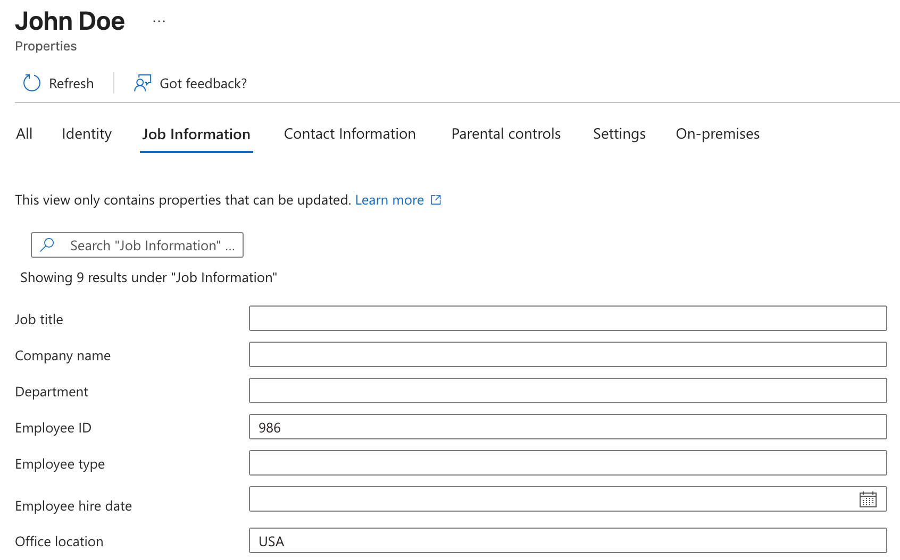
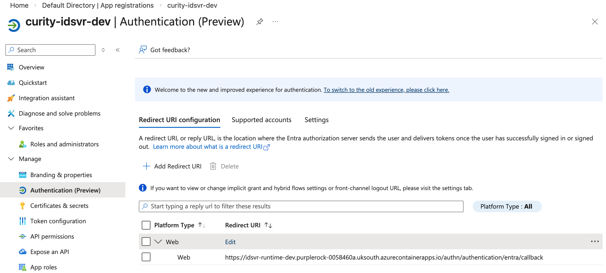
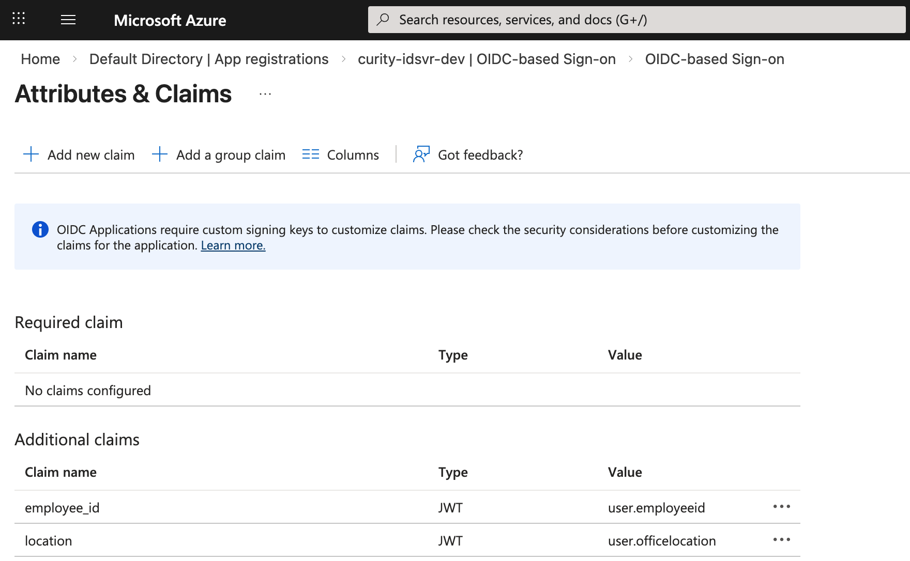
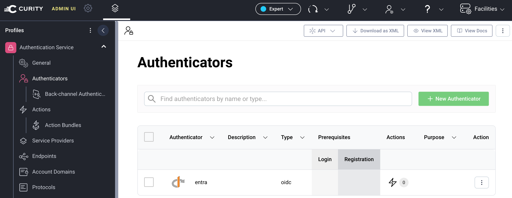

# OAuth Configuration

In this deployment, the Curity Identity Server does not store user accounts or authenticate users directly.   
Instead, it acts only as a specialist token issuer and does not use account management features.

## Entra ID User Accounts

In the example deployment, Entra ID stores user accounts and authenticates users.  
The Curity Identity Server receives claims containing user attributes, for `region` and `customer_id`.  
You can configure these values in your preferred Entra ID attributes:



## Entra ID Client

The deployment creates an app registration (OAuth client).  
Verify that the client has a client secret and a redirect URI that points to the Curity Identity Server.



You can define claims for the client that contain user attributes according to [Microsoft guides](https://learn.microsoft.com/en-us/entra/external-id/customers/how-to-add-attributes-to-token):



Update the manifest of the Entra ID client to include the following settings.   
Entra ID then issues claims to ID tokens with the current user's attribute values.

```json
{
  "acceptMappedClaims": true,
  "requestedAccessTokenVersion": 2
}
```

## Admin UI

After deployment, run the Admin UI for the Curity Identity Server, e.g.:

```bash
start $(azd env get-value IDSVR_ADMIN_URL)
```

Sign in with the following details:

- User: `admin`
- Password: The `ADMIN_PASSWORD` environment variable value

## OAuth Clients

In the Admin UI, view the OAuth clients:


The following components use the OAuth client settings to get access tokens:

- The console client runs a code flow with Entra ID user authentication
- The external gateway is a token exchange client
- The autonomous agent is also a token exchange client

## Authenticator

In the Admin UI, Entra ID is registered as an OpenID Connect authenticator:



View the properties of the authenticator:

- The `scope` setting may affect attributes that Entra ID returns to the Curity Identity Server.
- If the console client sends the `prompt=login` OpenID Connect parameter, that triggers a new Entra ID login.

## Authentication Action

After authentication completes, the Curity Identity Server runs custom logic to manipulate Entra ID attributes:


The following JavaScript logic runs, to transform Entra ID attributes and save them to the authentication context:

```javascript
function result(context) {
  var attributes = context.attributeMap;

  if (attributes.location && attributes.employee_id) {
    attributes.region = attributes.location;
    attributes.customer_id = attributes.employee_id;
  }

  return attributes;
}
```

## Scopes and Claims

Business scopes are defined in the Admin UI's token designer, with claim values evaluated at runtime.  
For each claim, the `Authentication Context Claims Provider` provides the value.


You could use the token designer to resolve other claim values from Entra ID user attributes.  
For example, the console client could receive name details in its ID tokens:

- Create a `profile` scope that contains the `given_name` and `family_name` claims.
- Add the `profile` scope to the console client.
- Drag the `given_name` and `family_name` claims into the ID token pane.
- Use the the claims provider to set name claim values from Entra ID user attributes.

## Token Exchange

Once user authentication completes, the console client receives an opaque access token.  
Tokens sent from the console client undergo 2 token exchanges that apply custom logic.  
To view the token exchange logic, navigate to `System / Procedures / Token Procedures`.  


