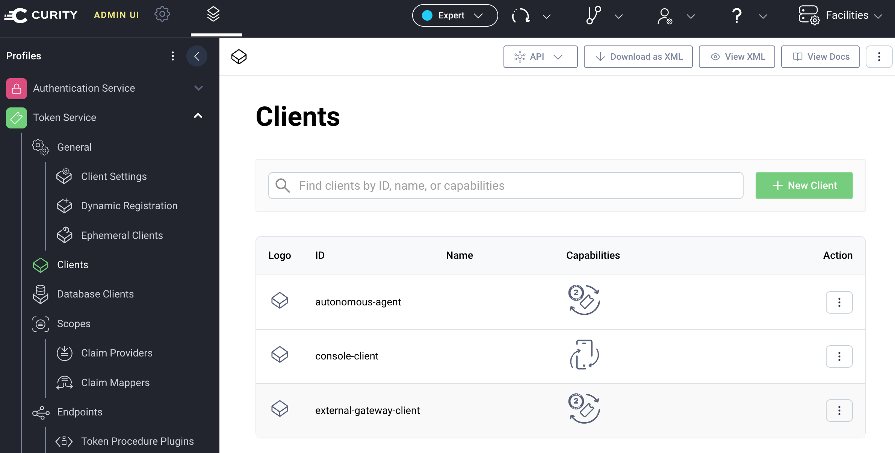
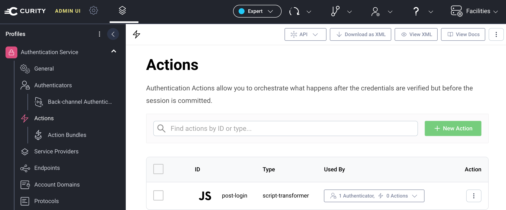
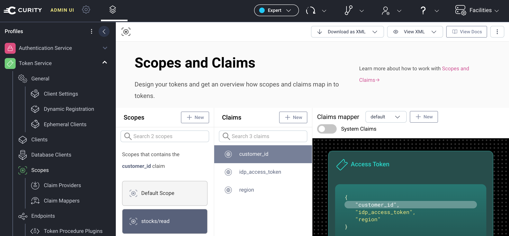
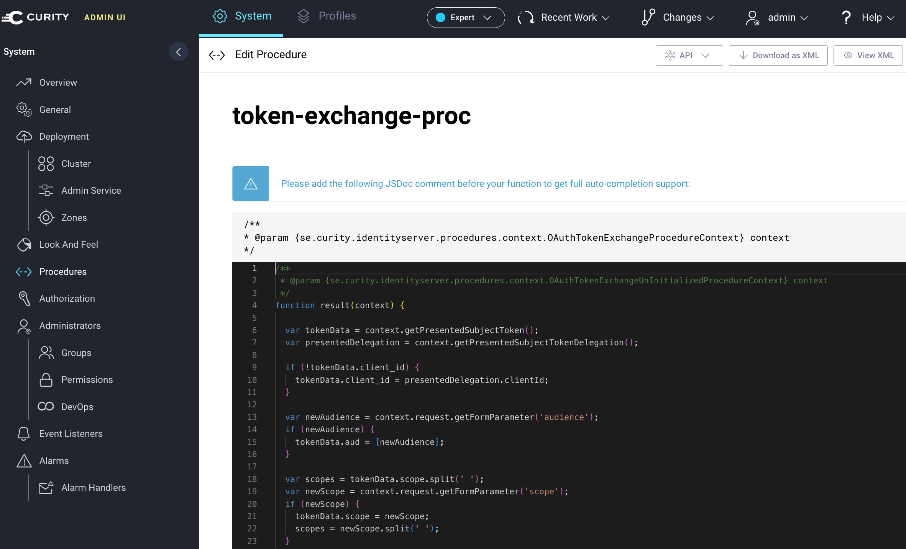

# OAuth Configuration

In this deployment, the Curity Identity Server's main role is a specialist token issuer.  
The Curity Identity Server does not need to store user accounts or authenticate users directly.   

## Admin UI

After deployment, run the Admin UI for the Curity Identity Server, e.g.:

```bash
open $(azd env get-value IDSVR_ADMIN_URL)
```

Sign in with the following details:

- User: `admin`
- Password: The `ADMIN_PASSWORD` environment variable value

If you run the local deployment, navigate to `http://localhost:6749/admin` instead.  
You can find the generated `ADMIN_PASSWORD` in the `tools/local/load-secrets.sh` file.

## OAuth Clients

In the Admin UI, view the OAuth clients:



The following components use the OAuth client settings to get access tokens:

- The console client runs a code flow with Entra ID user authentication
- The external gateway is a token exchange client
- The autonomous agent is also a token exchange client

## User Authentication

The example deployment uses [Passkeys](PASSKEYS.md) as the default authentication method.  
You can change that as required, for example to use Entra ID for user account storage and user logins.  
To do so, follow the steps in the [Authenticate Using Microsoft Entra ID](https://curity.io/resources/learn/oicd-authenticator-azure/) tutorial.

## User Attributes

In the example deployment, the Curity Identity Server uses user attributes for `region` and `customer_id`.  
If those values originate from an external identity system, the Curity Identity Server uses an authentication action to receive them:



The deployment includes the following example JavaScript logic, transform external attributes and save them to the authentication context:

```javascript
function result(context) {
  var attributes = context.attributeMap;

  if (attributes.location && attributes.employee_id) {
    attributes.region = attributes.location;
    attributes.customer_id = attributes.employee_id;
  }

  return attributes;
}
```

## Scopes and Claims

Business scopes are defined in the Admin UI's token designer, with claim values evaluated at runtime.  
For each claim, you can resolve claim values in various ways, e.g.:

- An `Script Claims Provider` to apply JavaScript logic to read the value from the user's account.
- An `Authentication Context Claims Provider` to read the value from the authentication context.



## Token Exchange

Once user authentication completes, the console client receives an opaque access token.  
Tokens sent from the console client undergo 2 token exchanges that apply custom logic.  
To view the token exchange logic, navigate to `System / Procedures / Token Procedures`.  


