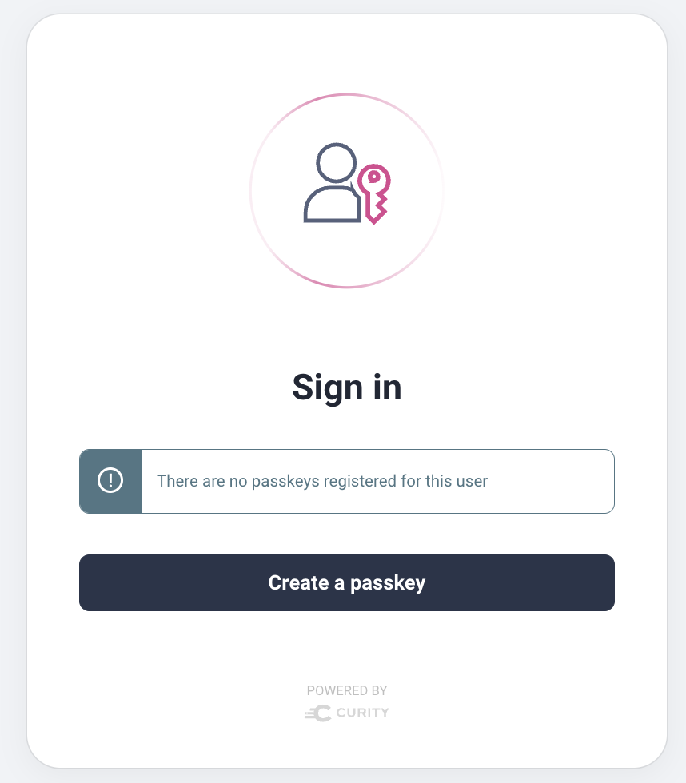
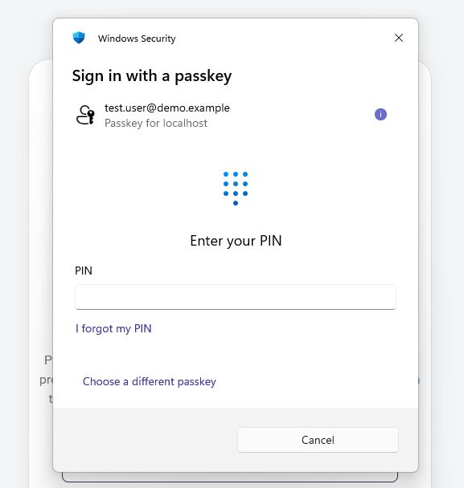
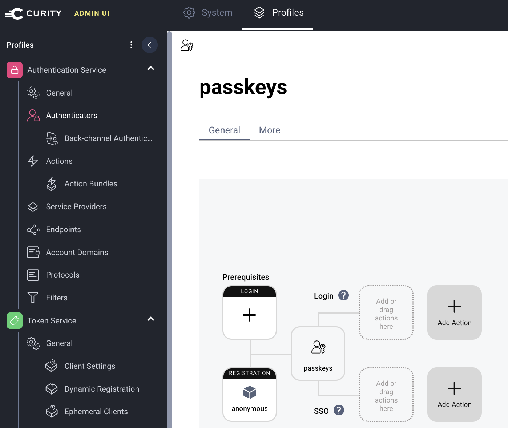

# Passkeys Authentication

The deployment uses passkeys authentication as a modern secure login method.  
You can change that to any other authentication method, e.g. to use an existing identity system.

## Login Screens

Passkey logins first prompt for an email and then present the following screen:

On the first login, you must choose the `Create a passkey` option.  
You must then provide an additional user gesture that uses the security built into the operating system.  
Windows Hello is used on Microsoft platforms, to provide a simple login experience.

On all subsequent logins, users should choose the `Sign in with a passkey` option.  
You must repeat the user gesture on every login, e.g with Windows Hello, to send the passkey.

## Hardening Passkey Logins

The example flow does the main password work but allows anyone to create an account and sign in, as a developer convenience.  
To make the flow production-ready you would need to perform at least the following additional steps:

- Require user authentication before creating a user account
- Require user authentication before creating a passkey

Those steps would require you to make minor changes to the deployment to reference additional infrastructure.  
For example, to use email authentication you could perform the following steps in the [Admin UI](OAUTH-CONFIGURATION.md):

- [Integrate an SMTP Server](https://curity.io/docs/identity-server/facilities/email-providers/email-providers-smtp/)
- [Create an Email Authenticator](https://curity.io/docs/identity-server/facilities/email-providers/email-providers-smtp/)

You would then replace the `anonymous` registration authenticator in the passkeys configuration with an email authenticator:

You can learn more about passkeys in [Curity articles](https://curity.io/resources/learn/what-are-passkeys/).
